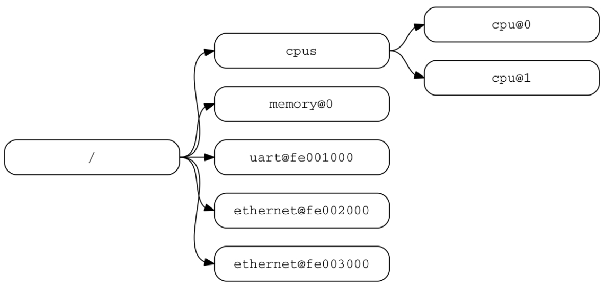
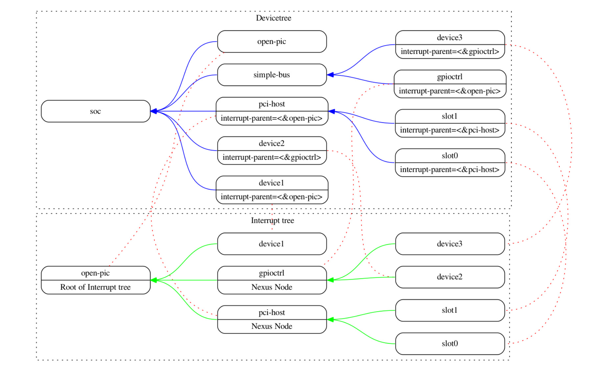

[<目录](../README.md)

## 2设备树

### 2.1概述

设备树规范阐述了一个用于描述系统硬件被称为**设备树**的结构。引导程序加载设备树到这client程序的内存中并把指向设备树的指针传给client程序。

本章节主要内容为设备树的逻辑结果和用于描述设备结点的基本属性集。第三章将通过DTSpec-compliant明确设备结点要求。第四章描述了设备树规范中设备bindings--对于清晰表达设备类型和类别的要求。第五章描述了设备树在内存中的编码格式。

设备树是一个树形的数据结构，它的结点描述了系统中对应的设备。每个结点用属性/值(key-value)对来描述设备的特征，并且除了root根结点以外，每个结点都有唯一的父结点。

在系统中，DTSpec-compliant设备树描述的设备信息，client程序不一定能动态的探测到。例如，PCI的架构使能client程序去探测相关/挂载的设备，因此可能不需要描述PCI设备的**设备树**结点。然而，如果它没能被probing探测到，那描述PCI host bridge设备的设备结点是必要的。

**例如**

**图2.1**为一个足够引导一个有平台类型、CPU、内存和串口的简易操作系统的简单设备树表现形式的例子。设备结点是以属性和值表示的。


<p align="center"><b>图2.1 设备树举例</b></p>


### 2.2 设备树结构与其规范

#### 2.2.1 结点名

**结点命名规则**

设备树中的每个结点的命名有如下规则:

> node-name@unit-address

其中`node-name`描述了结点的名字。它必须由1到31个有效字符(见表2.1)组成。

<p align = "center"><b>表2.1 有效字符</b></p>

| 字符 | 0 - 9 |  a - z   |  A - Z   |  ,   |   .    |   _    |  +   |   -    |
| :--: | :---: | :------: | :------: | :--: | :----: | :----: | :--: | :----: |
| 描述 | 数字  | 小写字母 | 大写字母 | 逗号 | 小数点 | 下滑线 | 加号 | 破折号 |


`node-name`必须以字母开头且应描述对应设备的类型。

`unit-address`明确了结点所在总线的位置。它由一个或多个表2.1中的`ASCII`字符组成。`unit-address`必须与结点的`reg`属性中的首地址匹配。如果结点没有`reg`属性，`unit-address`必须被省略且`node-name` 不能与同级其它`node-name`相同。特定总线可能会对`reg`和`unit-address`的格式有其他更多具体的要求。

root根结点没有`node-name`和`unit-address`，它用`/`表示。  



<p align="center"><b>图2.2 结点名举例</b></p>

图2.2：

- 图中名为cpu的结点通过`unit-address`的值0和1来区分
- 图中名为ethernet的结点通过`unit-address`的值`fe001000`和`fe003000`来区分


#### 2.2.2 推荐的通用命名

结点名应该尽可能的通用且能反映出设备的功能，而不是精确的编程模型。如果合适，应该从下面的名字中选择一个：

- adc
- accelerometer
- atm
- audio-codec
- audio-controller
- backlight
- bluetooth
- bus
- cache-controller
- camera
- can
- charger
- clock
- clock-controller
- compact-flash
- cup
- cups
- crypto
- disk
- display
- dma-controller
- dsi
- dsp
- eeprom: 电可擦可编程只读存储器
- efuse
- endpoint
- ethernet
- ethernet-phy
- fdc
- flash
- gnss
- gpio
- gpu
- gyrometer
- hdmi
- hwlock
- i2c
- i2c-mux
- ide
- interrupt-controller
- iommu
- isa
- keyboard
- key
- keys
- lcd-controller
- led
- leds
- led-controller
- light-sensor
- magnetometer
- mailbox
- mdio
- memory
- memory-controller
- mmc
- mmc-slot
- mouse
- nand-controller
- nvram
- oscillator
- parallel
- pc-card
- pci
- pcie
- phy
- pinctrl
- pmic
- pmu
- port
- ports
- power-monitor
- pwm
- regulator
- reset-controller
- rng
- rtc
- sata
- scsi
- serial
- sound
- spi
- sram-controller
- ssi-controller
- syscon
- temperature-sensor
- timer
- touchscreen
- tpm
- usb
- usb-hub
- usb-phy
- video-codec
- vme
- watchdog
- wifi


#### 2.2.3 路径名

设备树中的一个结点能够被从根结点开始的绝对路径所唯一标识，能逐层查找到所描述的结点。

制定一个设备路径的规则是：

> /node-name-1/node-name-2/node-name-N

例如，图2.2中`cup#1`的路径是：

> /cpus/cpu@1

这路径的根结点是`/`。

如果对于结点的绝对路径没有争议，那么`unit-address`可以被省略。

如果一个`Client Program`遇到一个模棱两可的路径，它的行为将是未定义的。


#### 2.2.4 属性

设备树中的每个结点都有属性来描述结点的特性。属性由键值对名字和值组成。

**属性名**

属性名由**表2.2**中字符组成的长为1～31的字符串。

<p align = "center"><b>表2.2 属性名的有效字符表</b></p>

| 字符 | 0 - 9 |  a - z   |  A - Z   |  ,   |   .    |   _    |  +   |   -    |  ？  | #    |
| :--: | :---: | :------: | :------: | :--: | :----: | :----: | :--: | :----: | :--: | ---- |
| 描述 | 数字  | 小写字母 | 大写字母 | 逗号 | 小数点 | 下滑线 | 加号 | 破折号 | 问号 | #号  |


非规范的属性名应该有一个唯一的字符前缀，像具有辨识度的公司或组织名来定义属性。例如：

```
fsl,channel-fifo-len
ibm,ppc-interrupt-server#s
linux,network-index
```

**属性值**

属性值是一个包含属性相关信息的数组。如果它表达的是true-false信息，那么它可能是一个空值。在这个案例中，详细的描述了属性的缺省性(有/无)。

<p align = "center"><b>表2.3：属性值</b></p>


|      值       |                             描述                             |
| :-----------: | :----------------------------------------------------------: |
|   \<empty>    | 值是empty。用来表示这个属性它自己是否存在的真假(true-false)信息。 |
|    \<u32>     | big-endian格式的32位整数。例如32位值 0x11223344 在内存中的形式为: |
|               |                          address 11                          |
|               |                         address+1 22                         |
|               |                         address+2 33                         |
|               |                         address+3 44                         |
|    \<u64>     | big-endian格式的64位整数，它由两个\<u32>组成。例如0x1122334455667788将被表示为2个单元:<0x11223344 0x4455667788> 它在内存中的形式为： |
|               |                          address 11                          |
|               |                         address+1 22                         |
|               |                         address+2 33                         |
|               |                         address+3 44                         |
|               |                         address+4 55                         |
|               |                         address+5 66                         |
|               |                         address+6 77                         |
|               |                         address+7 88                         |
|   \<string>   | 字符串是可打印的字符(不能是空格等)。例如"hello"它在内存中的形式为： |
|               |                         address 'h'                          |
|               |                        address+1 'e'                         |
|               |                        address+2 'l'                         |
|               |                        address+3 'l'                         |
|               |                        address+4 'o'                         |
|               |                        address+5 '\0'                        |
| \<stringlist> | 由多个\<string>组成的字符串列表。如"hello","world",他在内存中的形式为： |
|               |                         address 'h'                          |
|               |                        address+1 'e'                         |
|               |                        address+2 'l'                         |
|               |                        address+3 'l'                         |
|               |                        address+4 'o'                         |
|               |                        address+5 '\0'                        |
|               |                        address+6 'w'                         |
|               |                        address+7 'o'                         |
|               |                        address+8 'r'                         |
|               |                        address+9 'l'                         |
|               |                        address+10 'd'                        |
|               |                       address+11 '\0'                        |


### 2.3 标准属性

DTSpec描述了一个设备结点的标准属性集合。在这章将进行这些属性的说明。DTSpec(见第三章)设备结点的定义可能对关于标准属性的使用有另外的要求和约束。第四章中特定设备的表示也有一些具体的额外要求。

> 注意: 在本文档中所有设备树结点的示例中对其结点和属性的描述都使用DTS(Devicetree Source)格式。


#### 2.3.1 compatible

属性名：`compatible`

值类型：`<stringlist>`

描述：

`compatible`属性值由一个或多个字符串组成，为设备定义了规范的编程模式。这个字符串列表应该是被client program的设备驱动程序所选择使用。属性值由一系列以null结尾的字符串组成并且从左到右为具体到一般，即左边的字符串的含义为右边的子集。他们允许一个设备用一个系列的设备去表达其兼容性，可能允许单个设备驱动去匹配多个设备。

推荐的格式是"manufacturer,model",这里的`manufacturer`是一个描述制造商的字符串(例如股票代号)并且`model`表明了对应的型号。

举例:

```dtd
compatible = "fsl,mpc8641", "ns16550";
```

在这个例子中一个操作系统将先去查找支持`fsl,mpc8641`的设备驱动。如果没有找到，它将继续查找支持更通用的`ns16550`设备类型的驱动程序。


#### 2.3.2 model

属性名：model

值类型：`<string>`

描述：

`model`属性值是一个描述制造商设备型号的字符串。

推荐的格式是"manufacturer,model"。`manufacturer`是一个描述制造商的字符串(例如股票代号)并且`model`表明了对应的型号。

举例:

```dtd
model = "fsl,MPC8349EMITX"
```


#### 2.3.3 phandle

属性名：phandle

值类型：`<u32>`

描述：

`phandle`属性是结点在设备树中的唯一标识(id)。通常它的值被其他结点使用，来表示对它的引用。

举例：

  观察下面的devicetree的截取部分：

```dtd
pic@10000000 {
    phandle = <1>;
    interrupt-controller;
};
```

phandle的值是1。另外一个设备结点能够用phandle的值引用pic结点。

```dtd
another-device-node {
	interrupt-parent = <1>;
};
```


> **注意**：老的版本可能不同，包含这个属性不同的形式 `linux,phandle`。为了兼容性，如果`phandle`不存在，用户程序可能想支持`linux, phandle`。这意味着这连个属性的使用是相同的。


> **注意：** 大多在DTS中的devicetrees（看附录A）不包含显式的phandle属性。DTC工具会在DTS编译为DTB时候自动插入phandle属性。


#### 2.2.4 status

属性名：status

值类型：\<string>

描述：

`status`属性表示一个设备的操作状态。有效值如下表2.4。

<p align = "center"><b>表2.4：status属性值</b></p>

|     值     |                             描述                             |
| :--------: | :----------------------------------------------------------: |
|   "okay"   |                       设备是可操作状态                       |
| "disabled" | 表明当前不可操作，但未来可能变成可操作的(例如：一些没插入或未关闭)。特定设备的disabled 情参考设备绑定 |
| "reserved" | 表明设备可操作但不应该使用。典型的是设备的使用是通过其他软件组件控制的，如平台固件 |
|   "fail"   |  表明设备不可操作。探测到设备出错并不可能修复变成可操作状态  |
| "fail-sss" |              同上，并`sss`表明错误条件被检测到               |


#### 2.2.5 #address-cells 和 #size-cells

属性名：`#address-cells`,`#size-cells`

值类型：\<u32>

描述：

`#address-cells`,`#size-cells`属性可能被使用在设备树层次结构和描述孩子结点怎样被寻找且有孩子的结点中。`#address-cells` 属性定义了\<u32> 单元用于表示在孩子结点的`reg`属性的地址, `#size-cells`表示其大小。

`#address-cells`,`#size-cells`属性不能从祖先结点继承，他们应该显示定义。

一个DTSpec-compliant boot程序应该在所有孩子的结点提供`#address-cells` 和`#size-cells`。

如果没有提供，程序应该假定`#address-cells`为默认值2，`#size-cells`默认值为1。

举例：

```dtd
soc {
    #address-cells = <1>;
    #size-cells = <1>;

    serial@4600 {
        compatible = "ns16550";
        reg = <0x4600 0x100>;
        clock-frequency = <0>;
        interrupts = <0xA 0x8>;
        interrupt-parent = <&ipic>;
    };
};
```

例子中soc结点中`#address-cells`,`#size-cells`都设置为1。这代表要求用一个(\<32>)单元表明地址和大小。

其中在soc结点中的serial设备的`reg`属性必须遵守这个规定-----用一个单元(0x4600)表示地址和用一个单元(0x100)表示大小


#### 2.2.6 reg

属性名：`reg`

属性值：`<prop-encoded-array>`  把 (address, length) '键值对'编码/组成数组。

描述：

`reg`属性描述的是挂载在总线上的设备资源地址。通常表示IO寄存器块内存映射的偏移地址和长度，但在一些总线类型上可能有不同的含义。root结点在地址空间中定义的地址是CPU实地址。

它的值是`<prop-encoded-array>`,由地址和长度的'键值对'组成，`<address, length>`。其中`address`和`length`是由总线指定的以`<32u>`类型为单元/位?的数据，并且是由该设备结点的父结点中 `#address-size` `#size-cells`属性来描述。如果父结点中`#size-cells`的值是0，那么`reg`属性中的 `length`域应该被省略。

举例：

假设一个设备在片上系统上有两个寄存器块，它们在SOC上的偏移地址和大小分别为`(0x3000, 0x20)`, `(0xFE00 0x100)`。这`reg`属性将被编码成如下形式(假设`#address-size` `#size-cells`的值都是1)：

```dtd
reg = <0x3000 0x20 0xFE00 0x100>
```


#### 2.3.7 virtual-reg

属性名：`virtual-reg`

值类型：`<u32>`

描述：

`virtual-reg`描述的是映射到设备节点`reg`属性中的第一个物理地址的有效地址。这个属性使能了 boot 程序对 client 程序虚拟地址到物理地址的映射的建立。


#### 2.3.8 ranges

属性名：`ranges`

值类型：`<empty>` 或 `<prop-encoded-array>` 编码成`(child-bus-address,parent-bus-address,length)`形式的三元组

描述：

`ranges`属性表示的是总线地址空间和其父地址空间的映射或转化。
其属性的值的格式为三元组`(child-bus-address,parent-bus-address,length)`，值是任意数。

- `child-bus-address` 是在子总线地址空间的物理地址。对于当前地址单元的值是总线依赖的，并且能从这节点的`#address-cells`属性中确定（现式`ranges`属性的节点）。

- `parent-bus-address`是父总线地址空间的物理地址。总线依赖且可以从定义 `parent-bus-address`节点中的`address-cells`属性确定

- `length` 是子地址空间范围的长度，能中当前节点的`size-cells`属性确定。

如果该属性被定义为`<empty>`，则表明父地址空间和孩子地址空间是一样的，并且没有地址转换要求。

如果这个属性在一个总线节点中不存在，表明没有地址空间映射存在。

**地址转换例子：**

``` dtd
soc {
    compatible = "simple-bus";
    #address-cells = <1>;
    #size-cells = <1>;
    ranges = <0x0 0xe0000000 0x00100000>;
    
    serial@4600 {
        device_type = "serial";
        compatible = "ns16550";
        reg = <0x4600 0x100>;
        clock-frequency = <0>;
        interrupts = <0xA 0x8>;
        interrupt-parent = <&ipic>;
    };
};
```

soc节点的range属性的值是`<0x0 0xe0000000 0x00100000>`;

它描述了一个1024k大小的地址空间，从孩子节点的物理地址0x0映射到父物理地址0xe0000000。通过映射，serial设备节点能加载或存储（load or store）访问地址0xe0004600（通过在ranges中的映射的0xe0000000加上0x4600的偏移来寻址）。


#### 2.3.9 dma-ranges

属性名：`dam-ranges`

值类型：`<empty>` 或 `<prop-encoded-array>` 编码成`(child-bus-address,parent-bus-address,length)`形式的三元组

描述：

`dam-ranges`属性通常是描述一个内存总线映射的DMA结构，设备书的上级能被来自总线的DMA操作访问。它提供了在总线和其父（节点）之间的物理地址转换。

这个属性值的格式是一个任意数字的三元组`(child-bus-address,parent-bus-address,length)`。每个三元组描述了一个相邻的DMA地址范围。三元组的元素与属性`ranges`的功能类似。


#### 2.3.10 name (弃用)

#### 2.3.11 device_type (弃用)


### 2.4 中断和中断映射

DTSpec 兼容当前OFRP：Interrupt Mapping，Version 0.9 中的中断树模型。一个设备树存在一个逻辑中断树来表示平台硬件的层次和路由。虽然通常说其是一个中断树，跟严格的说是一个有向无环图。

对于一个中断控制器的中断源的物理线在设备树中是由属性`interrupt-parent`来表示。表示中断生成设备的节点包含`interrupt-parent`属性，该属性有一个phandle值，指向中断路由到的设备，通常是一个中断控制器。如果一个中断生成设备没有`interrupt-parent`属性，那么会假设他中断的父节点是它的设备树的父节点。

每个中断生成设备，包含一个`interrupt`属性，用一个值来描述这个设备的一个或多个中断源。每个中断源都用称为中断描述符的信息表示。中断说明符的格式和含义是特定于中断域的，它是取决于中断域根节点上的属性。`#interrupt-cells`属性由中断域的根用来定义中断说明符所需的`<u32>`值的数量。例如，对于开放式PIC中断控制器，中断说明符合采用两个32位值，由中断号和中断的级别/检测信息组成。

中断域是解释中断说明符的上下文。域的根是中断控制器或中断连接。

- 中断控制器控制器是一个物理设备，需要一个驱动程序来处理由它路由的中断。它也可能级联到另一个中断域。中断控制器是由设备树该节点上的`interrupt-controller`属性指定的。
- 中断连接定义了一个中断域和另一个中断域的转换。翻译是基于具体域和具体中线信息的。域之间的转换是通过属性`interrupt-map`完成的。例如，PCI控制器设备节点可能是一个中断连接，它定义了从PCI中断命名空间（INTA，INTB，等）到带有中断请求（IRQ）号的中断控制器的转换。

当中断树遍历到一个没有`interrupt`属性且没有显式的父节点的中断控制器节点时，这中断树的根节点将被确定。

图2.3显示了中断父关系的设备树的图表示。它显示了设备树的自然结构以及每个节点在逻辑中断树中的位置。



在图2.3中：

- 中断树的根节点是`open-pic`中断控制器。
- 中断树根节点有三个孩子节点--直接路由他们的中断到`open-pic`
    - device1
    - PCI host controller
    - GPIO Controller

- 存在三个中断域；一个根节点是`open-pic`,一个根节点是`PCI host bridge`和一个根节点是`GPIO Controller` 。
- 两个连接节点，`PCI host bridge` 和 `GPIO controller`。


#### 2.4.1 中断生成设备的属性

**interrupts**

属性：interrupts

值类型：`<prop-encoded-array>` 编码为任意数量的中断说明符

描述：

设备节点的`interrupts`属性定义了设备生成的一个或多个中断。该属性的值友任意多个中断描述符组成。中断描述符的格式由中断域的根的绑定定义的。

`interrupts`会被`interrupts-extended`属性覆盖，通常只应用其中一个

例子：

通常在一个PIC兼容中断域中中断描述符的定义是由两个单元组成--一个中断号和电平/检测信息。如下面的例子，定义了一个中断描述符，其中包括一个中断号0xA和电平/检测编码为8。

```dtd
interrupts = <0xA 8>;
```

**interrupt-parent**

属性：`interrupt-parent`

值类型：`<phandle>`

描述：

因为在中断树中节点的层级可能不匹配设备树，`interrupt-parent`属性可用于显示定义中断父节点。它的值是父级的phandle。如果一个设备中没有该属性，将默认它设备树的父节点为其在中断树中的父级。


**interrupts-extended**

属性：`interrupts-extended`

值类型：`<phandle>` `prop-encoded-array`

描述：

属性`interrupts-extended`属性列出了设备生成的中断。当一个设备连接多个中断控制器时，应该使用`interrupts-extended`而不是`interrupts`属性，因为它用每个中断描述符对父节点phandle进行编码。

例子：

这个例子将展示怎样使用`interrupts-extended`属性描述一个设备两个中断输出连接到不同的中断控制器的描述。`pic`是`#interrupt-cells`为2的中断控制器，`gic`是`#interrupt-cells`为1的中断控制器。

```dtd
Interrupts-extended = <&pic 0xA 8>, <&tic 0xda>;
```

`interrupts` 和 `interrupts-extended`属性是相互独立的。一个设备应该只使用其中一个。只有当需要与不了解`interrupt-extended`的软件兼容时，才允许同时使用这两种方法。如果同时存在`interrupts-extended`和`interrupts`，则`interrupts-extended`优先。


#### 2.4.2 中断控制器属性

**#interrupt-cells**

属性：`#interrupt-cells`

值类型：`<u32>`

描述：

`#interrupt-cells`属性描述了中断域中中断描述符单元数量的定义。


**interrupt-controller**

属性：`interrupt-controller`

值类型：`<empty>`

描述：

存在`interrupt-controller`属性的节点为中断控制器节点。


#### 2.4.3 中断级联属性


